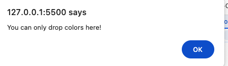

# Animal Color Categorizer

This is a simple web application where users can drag and drop animals into an animal zone and colors into a color zone. The application fetches a list of animals and colors from a node.js server, and users can interact with these lists through a drag-and-drop interface.

## Features

- Fetches animal and color data from a server (`http://localhost:3000/animalColor`).
- Allows users to drag animals and colors into designated drop zones.
- The animal can only be dropped into the **Animal Zone**.
- The color can only be dropped into the **Color Zone**.
- Visual feedback is provided for valid and invalid drops.
- 
- 


## Technologies Used

- HTML
- CSS
- JavaScript (Vanilla)
- Fetch API (for server communication)

## Setup and Installation

To get the project running locally, follow the steps below.

### 1. Clone the Repository

Clone the repository to your local machine using Git:

```
git clone https://github.com/cxz161530/animalColor
cd animalColor
npm install
npm start
```


### 2. Open html and enjoy our app!


